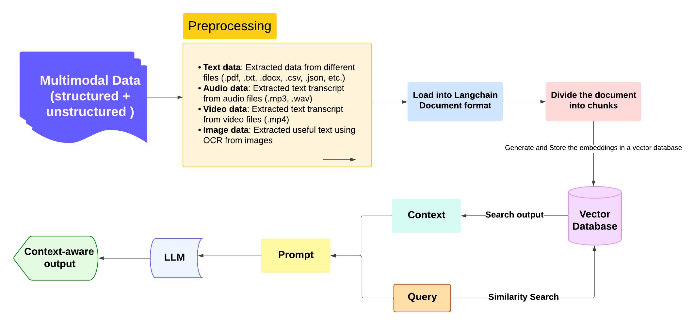

# 🌟 Multimodal Document Processing with LangChain 🌟

This project is a **Streamlit application** for processing multimodal documents and querying a **Milvus database**. It leverages cutting-edge tools like **LangChain**, **transformers**, **EasyOCR**, and others for processing, storing, and querying text extracted from various file types. 🚀

---

## ✨ Features

### 🗂️ **Upload File Processing**:
- Supports multiple file types: `audio`, `video`, `image`, `text`, `csv`, `yaml`, `json`, `docx`, and `pdf`.
- Extracts text content using:
  - 🔊 **Audio**: `speech_recognition` and `pydub`.
  - 🎥 **Video**: Custom extraction logic.
  - 🖼️ **Image**: `EasyOCR`.
  - 📄 **Text/Logs/Documents**: LangChain loaders.

### 🛠️ **Milvus Integration**:
- 🗃️ Stores processed document embeddings for similarity-based querying.
- 🧠 Utilizes `HuggingFaceEmbeddings` for generating vector representations.

### 🔍 **Query Interface**:
- Natural language query interface.
- Implements a **Retrieval-Augmented Generation (RAG)** pipeline for AI-driven responses.

---

## 🛠️ Installation

### 🔧 Prerequisites
- Python 3.8+
- `pip` or `conda` package manager
- CUDA-compatible GPU (optional, for faster processing)

### 📥 Clone the Repository
```bash
git clone https://github.com/yourusername/multimodal-document-processing.git
cd multimodal-document-processing
```
# 📦 Install Dependencies
```bash
pip install -r requirements.txt
```
## 🚀 Usage
### 🖥️ Start the Application


Run the Streamlit app:

```bash
streamlit run app.py
```

## 🔄 Application Modes

### 📤  Upload Files:
- Upload a file to process and store its content in Milvus.
- Displays extracted content and stores embeddings in the database.

### ❓ Query:
- Enter a question to search and retrieve relevant information from the Milvus database.
- Returns AI-generated responses using LangChain's RAG pipeline.

## 📁 File Structure
```bash
## 📁 **File Structure**

```bash
project/
│
├── app.py                      # 🎯 Main Streamlit application
├── requirements.txt            # 📦 Python dependencies
├── utils/                      # 🛠️ Utility modules
│   ├── audio_utils.py          # 🎵 Audio file processing
│   ├── video_utils.py          # 📹 Video file processing
│   ├── image_utils.py          # 🖼️ Image file processing
│   ├── document_loaders.py     # 📜 Document processing loaders
│   ├── milvus_client.py        # 🗄️ Initializes Milvus database
│
├── milvus_database.db          # 🗃️ Milvus database file (auto-created)
├── Dataset                     # 📂 Folder to store datasets
├── Images                      # 📁 Folder for storing images

```
🔑 **Key Modules**

### `app.py`
🧩 **Main application logic**  
- Handles file uploads, document processing, and querying.

### `utils/`
- 🎵 **Audio**: Splits audio into chunks and transcribes text.  
- 📹 **Video**: Processes video files to extract and analyze content.  
- 🖼️ **Image**: Uses EasyOCR for extracting text.  
- 📜 **Logs/Documents**: Processes CSV, YAML, JSON, and PDF files into structured LangChain documents.

---

🛠️ **Example Workflow**


### 📤 **Uploading a File**
1. Select **"Upload Files"** mode.  
2. Upload a file (e.g., `example.pdf`).  
3. Process and store the file in the database.  

### ❓ **Querying the Database**
1. Select **"Query"** mode.  
2. Enter a natural language question.  
3. Receive a concise, fact-based response.  



---

🌟 **Future Improvements**
- 🔍 Add more advanced query capabilities.  
- 📂 Enhance support for additional file types and embeddings.  
- ⚡ Improve scalability for larger datasets.  

---

📜 **License**
This project is licensed under the **MIT License**. See the LICENSE file for more information.

---

🙌 **Acknowledgments**
- 🌐 **Streamlit** for the interactive UI.  
- 📚 **LangChain** and **Milvus** for document processing, retrieval and vector db.  
- 🤖 **Transformers** for embedding generation.  
- 🖼️ **EasyOCR** for image text extraction.  
- 📹 **Moviepy** for video processing.
